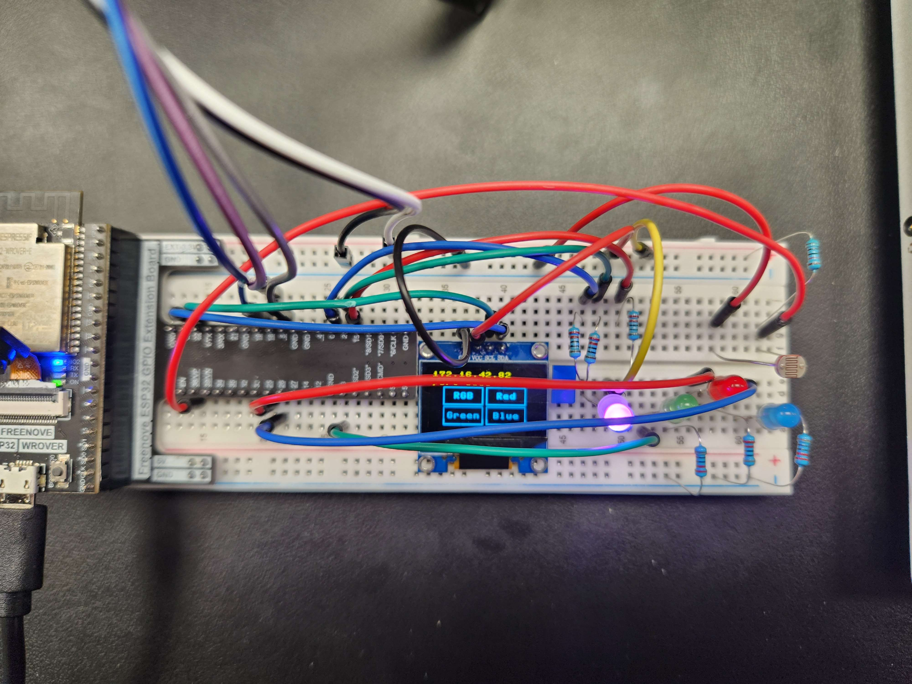
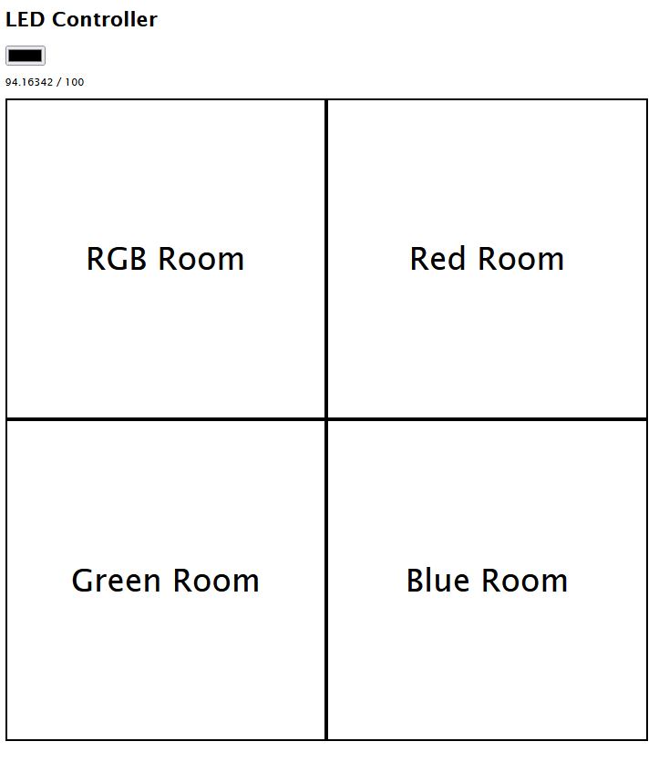
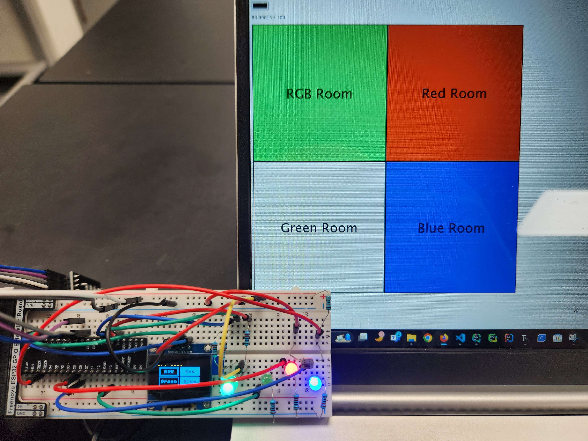

# Internet Of Things Final Project
## Tyler Guldberg

# Steps
- Setup the following circuit:

There are five major sections of this circuit
- RGB LED
- 3 Individual LEDs
- Rotary Encoder
- OLED Display
- Photoresistor

These components on their own would make a neat product, however this class is called **Internet** of Things, so an
internet component will only heighten this products use!

Through the power of Websockets, we can have a webpage display _and control_ the data and states of the breadboard.


A really simple webpage like above can control the lights in their entirety. Not only that, but the webpage works
seamlessly with the breadboard components in tandem! Control from both the webpage or the breadboard to your hearts
content.

- The bulk of this work is through websockets: [main.py](main.py)

Websockets allow two way communication between the board and the webpage. This enables both 'clients' to work in tandem.

```html
<script>
    const ip = 'ADDRESS';
    window.addEventListener("load", function () {
        let ws = new WebSocket(`ws://${ip}/slider`);
        let photoWs = new WebSocket(`ws://${ip}/ldr`)

        rooms = [document.getElementById('RedRoom'), document.getElementById('GreenRoom'), document.getElementById('BlueRoom')]
        roomColors = ['#ff0000', '#00ff00', '#0000ff']
        roomBools = [false, false, false]

        ws.onmessage = (event) => {
            data = JSON.parse(event.data); // String containing states of LEDs and RGB LED color in hex
            document.getElementById("RGBroom").style.background = 'rgb(' + String(data[0]) + ')';
            document.getElementById("colorPicker").value = 'rgb(120, 76, 200)';

            for(let i = 0; i < data.length; i++) {
                if(i > 0) {
                    if(data[i]) {
                        rooms[i - 1].style.background = roomColors[i - 1];
                    }
                    else {
                        rooms[i - 1].style.background = '#ffffff';
                    }
                    roomBools[i] = data[i];
                    roomUpdate(rooms[i - 1], roomBools[i], roomColors[i - 1]);
                }
            }
        }

        photoWs.onmessage = (event) => {
            data = JSON.parse(event.data);
            document.getElementById("LDRStatusLabel").innerText = data + ' / 100';
        }

        ws.onclose = (event) => {
            console.log("websocket closed");
        }
        ws.onerror = (event) => {
            console.log("websocket error: ", event);
        }

        function roomUpdate(room, roomBool, roomColor) {
            if(roomBool) {
                room.style.background = roomColor;
            }
            else {
                room.style.background = '#ffffff';
            }
        };
        
        rooms[0].addEventListener("click", function () {
            data = JSON.stringify({ led: 1 });
            roomBools[1] = !roomBools[1];
            roomUpdate(rooms[0], roomBools[1], roomColors[0]);
            ws.send(data); // Send back id of the LED that was clicked
            console.log("red clicked");
        });

        rooms[1].addEventListener("click", function () {
            data = JSON.stringify({ led: 2 });
            roomBools[2] = !roomBools[2];
            roomUpdate(rooms[1], roomBools[2], roomColors[1]);
            ws.send(data);
            console.log("green clicked");
        });

        blueRoom = document.getElementById("BlueRoom");
        rooms[2].addEventListener("click", function () {
            data = JSON.stringify({ led: 3 });
            roomBools[3] = !roomBools[3];
            roomUpdate(rooms[2], roomBools[3], roomColors[2]);
            ws.send(data);
            console.log("blue clicked");
        });

        colorPicker = document.getElementById("colorPicker");
        colorPicker.addEventListener("change", function () {
            document.getElementById("RGBroom").style.background = colorPicker.value;
            console.log(colorPicker.value);
            data = JSON.stringify({ rgb: colorPicker.value });
            ws.send(data);
            console.log("rgb changed");
        });
    });

</script>
```
- This is all of the logic that sends and receives data to and from the board. 

The bulk of this product is having two way
communication using Websockets and demonstrating different applications of this concept (in this case with individual LEDs, a
RGB LED that is synchronized, and full control of them all from two locations at once!).


And this shows the synchronization of the board and webpage.

[FinalProject.zip](FinalProject.zip)

All of the necessary files are in this zip file. Simply download it, upload it all to ESP32, and hit run!

Do you need to have control over your lights all of the time? Of course you do, and with this neat little product, you
can have all the control one could ask for!

_(In all seriousness, I do wish I had the time to refactor a great deal of this code. Namely, making a menu class to
handle callback functions and menu navigation with the rotary encoder which would clean up `main.py` a ton. Also
breaking up each device 'section' into different Websockets to greatly simplify the data that gets sent to and from.)_
